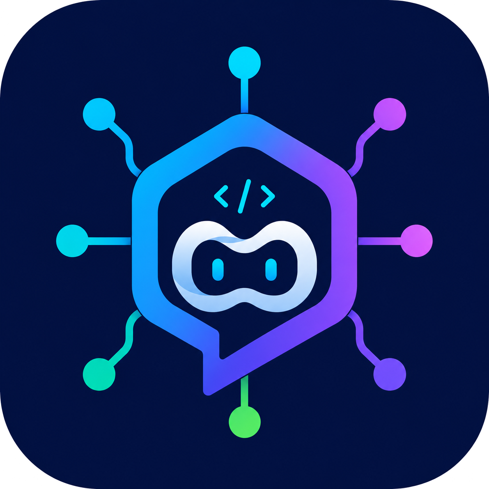

<div align="center">



<h1>Universal Chat Provider</h1>

<p>
  <b>The VS&nbsp;Code extension that brings your Claude, ChatGPT&nbsp;/&nbsp;Codex, Antigravity, and more subscriptions into GitHub&nbsp;Copilot&nbsp;Chat</b><br/>
  <sub>No API key — just OAuth&#8209;login the subscriptions you already pay for.</sub><br/>
  <sub>…and use them to write your Git commit messages, too.</sub>
</p>

<p>
  <a href="https://marketplace.visualstudio.com/items?itemName=maxdewald.universal-chat-provider"></a>
  <a href="https://marketplace.visualstudio.com/items?itemName=maxdewald.universal-chat-provider"></a>
  
  
</p>

<p>
  
  
  
  
  
</p>

<p>
  <a href="#features"><b>Features</b></a> &nbsp;·&nbsp;
  <a href="#quick-start"><b>Quick start</b></a> &nbsp;·&nbsp;
  <a href="#supported-logins"><b>Logins</b></a> &nbsp;·&nbsp;
  <a href="#configuration"><b>Configuration</b></a>
</p>

<p>
  <sub>Powered by <a href="https://github.com/router-for-me/CLIProxyAPI"><b>CLIProxyAPI</b></a></sub>
</p>

</div>

---

## Features

- **Native model picker** — your subscription models appear under *Universal Chat Provider* in Copilot Chat, with context, output, tool, image, and reasoning metadata.
- **Reasoning support** — models with multiple reasoning levels use VS Code's built-in selector, and emitted reasoning summaries stream into a collapsible thinking block.
- **Utility model** — point Copilot's commit messages, chat titles, and summaries at your subscription models with one command. No Copilot subscription required.
- **Zero setup (managed mode)** — the extension downloads, verifies, and supervises the proxy for you; one shared server across all windows.

## Supported logins

Sign in with any subscription you already have — no API key:

- 🟣 **Claude** — Claude Code / Pro / Max
- 🟢 **Codex** — ChatGPT Plus / Pro
- ⚪ **Grok** — Grok Build
- 🟡 **Kimi** — Moonshot
- ⚫ **Antigravity**

> [!WARNING]
> **Use entirely at your own risk and discretion.** This extension routes chat through your personal AI **subscription** accounts (Claude, ChatGPT / Codex, Antigravity, …) over OAuth. Accessing these subscriptions outside their official apps may violate the providers' **Terms of Service** and could result in rate limiting or account suspension. You alone are responsible for how you use it.

## Quick start

> Requires **VS Code 1.124+** and the **GitHub Copilot Chat** extension.

1. **Install** — get *Universal Chat Provider* from the **[VS Code Marketplace](https://marketplace.visualstudio.com/items?itemName=maxdewald.universal-chat-provider)**. Prefer to build it yourself? See [Development](#development).
2. **Add an account** — accept the **Add Account** prompt (or run `Universal Chat Provider: Add Account`), pick a provider, and complete OAuth in your browser. Models refresh automatically.
3. **Chat** — open Copilot Chat and select a model under **Universal Chat Provider**.

Manage everything from the status bar item or the *Universal Chat Provider: Manage Provider* command — list/remove accounts, restart, update, or reset the managed server.

<details>
<summary><b>External mode</b> — bring your own CLIProxyAPI server</summary>

<br>

Prefer to run CLIProxyAPI yourself (e.g. a remote or shared instance)?

1. Set `universalChatProvider.server.mode` to `external`.
2. Start CLIProxyAPI and complete the provider login there.
3. Use the **Import API Key** notification action (when a local config is found) or *Configure Connection* to set the URL and key manually.

The API key is stored in VS Code `SecretStorage`. In external mode the extension never starts or stops the server. If your server exposes a plaintext `remote-management.secret-key`, the **Add Account** and **Manage Accounts** commands work against it too.

</details>

## Utility model

Copilot generates commit messages, chat titles, and summaries with its own background models. Run *Universal Chat Provider: Set Utility Model* (or use the status bar menu) to point Copilot's `chat.utilityModel` and `chat.utilitySmallModel` at one of your subscription models instead, so those background flows run through your accounts. When the model supports thinking levels, the command also asks for the utility Thinking Effort; commit messages use `chat.utilitySmallModel` plus that effort. No Copilot subscription required. Clear the selection to undo.

## How it works

GitHub Copilot Chat normally only talks to Copilot's own models. This extension bridges that gap: it runs a local [CLIProxyAPI](https://github.com/router-for-me/CLIProxyAPI) server, logs you into your AI subscriptions via OAuth, and registers their models as a **native chat provider** in VS Code. Pick them straight from the Copilot model dropdown.

```
   Your subscriptions          Local proxy             VS Code
  ┌────────────────────┐     ┌──────────────┐     ┌──────────────────┐
  │ Claude             │     │              │     │  Copilot Chat    │
  │ ChatGPT / Codex    │──┐  │              │  ┌─▶│   model picker   │
  │ Antigravity        │  ├─▶│  CLIProxyAPI │──┤  ├──────────────────┤
  │ Grok · Kimi · …    │──┘  │   (OAuth)    │  └─▶│  Utility model   │
  └────────────────────┘     └──────────────┘     └──────────────────┘
```

## Configuration

<details>
<summary>All settings</summary>

<!-- configs -->

| Key                                           | Description                                                                                                            | Type      | Default                   |
| --------------------------------------------- | ---------------------------------------------------------------------------------------------------------------------- | --------- | ------------------------- |
| ▿ <b>Connection</b>                           |
| `universalChatProvider.server.mode`           | How CLIProxyAPI is provided.                                                                                           | `string`  | `"managed"`               |
| `universalChatProvider.baseUrl`               | CLIProxyAPI server URL. Used only in external mode.                                                                    | `string`  | `"http://127.0.0.1:8317"` |
| `universalChatProvider.configPath`            | Optional CLIProxyAPI config.yaml path for credential and model metadata discovery.                                     | `string`  | `""`                      |
| `universalChatProvider.autoDetectConfig`      | Search common CLIProxyAPI config locations when no config path is set.                                                 | `boolean` | `true`                    |
| ▿ <b>Managed Server</b>                       |
| `universalChatProvider.server.version`        | CLIProxyAPI release for managed mode. Use a pinned version for reproducible installs, or latest to track new releases. | `string`  | `"7.2.5"`                 |
| `universalChatProvider.server.suggestUpdates` | Offer same-major updates for pinned managed server versions.                                                           | `boolean` | `true`                    |
| ▿ <b>Advanced</b>                             |
| `universalChatProvider.debug`                 | Show prompt-cache hit rate and write per-request diagnostics to extension storage.                                     | `boolean` | `false`                   |

<!-- configs -->

</details>

<details>
<summary>All commands</summary>

<!-- commands -->

| Command                                  | Title                                                                                |
| ---------------------------------------- | ------------------------------------------------------------------------------------ |
| `universalChatProvider.manage`           | Universal Chat Provider: Manage Provider                                             |
| `universalChatProvider.login`            | Universal Chat Provider: Add Account (Login)                                         |
| `universalChatProvider.manageAccounts`   | Universal Chat Provider: Manage Accounts                                             |
| `universalChatProvider.showQuota`        | Universal Chat Provider: Show Quota                                                  |
| `universalChatProvider.restartServer`    | Universal Chat Provider: Restart Managed Server                                      |
| `universalChatProvider.updateBinary`     | Universal Chat Provider: Update Proxy Binary                                         |
| `universalChatProvider.resetServer`      | Universal Chat Provider: Reset Managed Server                                        |
| `universalChatProvider.configure`        | Universal Chat Provider: Configure Connection                                        |
| `universalChatProvider.importConfig`     | Universal Chat Provider: Import API Key from Config                                  |
| `universalChatProvider.refresh`          | Universal Chat Provider: Refresh Models                                              |
| `universalChatProvider.setUtilityModel`  | Universal Chat Provider: Set Utility Model (commit messages, chat titles, summaries) |
| `universalChatProvider.clearCredentials` | Universal Chat Provider: Clear Stored API Key                                        |
| `universalChatProvider.showLogs`         | Universal Chat Provider: Show Logs                                                   |
| `universalChatProvider.showServerLogs`   | Universal Chat Provider: Show Server Output                                          |
| `universalChatProvider.openSettings`     | Universal Chat Provider: Open Settings                                               |

<!-- commands -->

</details>

## Development

```bash
pnpm install
pnpm vscode:dts
pnpm check          # lint + typecheck + tests + build
pnpm ext:package    # produce an installable .vsix
```

Press `F5` from VS Code Insiders to launch the Extension Development Host with the proposed APIs enabled.

## License

[MIT](./LICENSE.md) · Not affiliated with GitHub, OpenAI, Anthropic, or Google.
