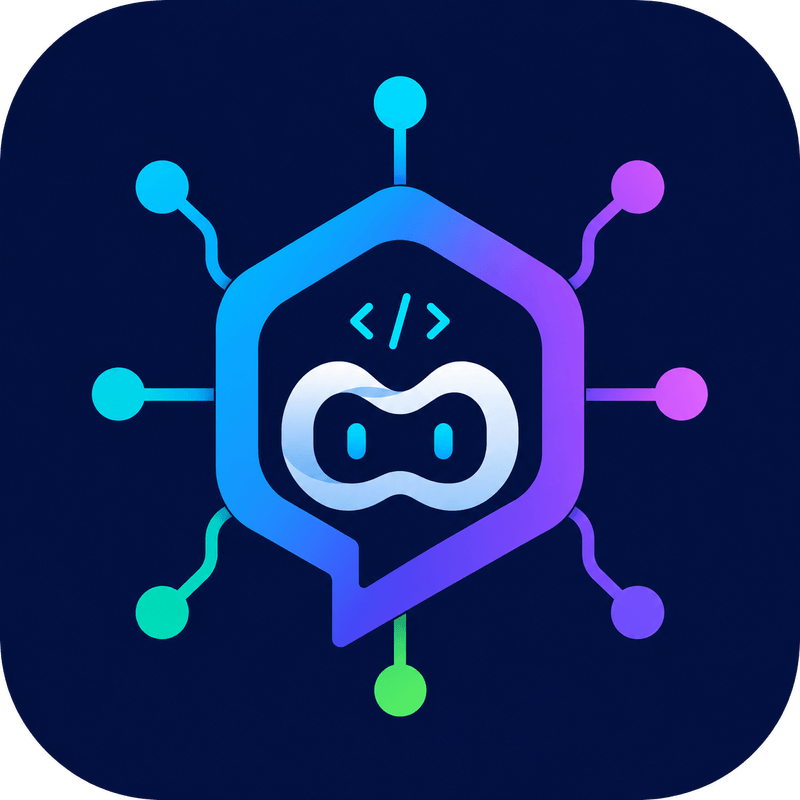
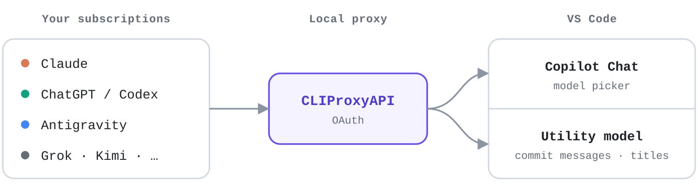

<div align="center">



<h1>Universal Chat Provider</h1>

<p>
  <b>The VS&nbsp;Code extension that brings your Claude, ChatGPT&nbsp;/&nbsp;Codex, Antigravity, and more subscriptions into GitHub&nbsp;Copilot&nbsp;Chat</b><br/>
  <sub>No API key — just OAuth. <br/>…and use them to write your Git commit messages, too.</sub>
</p>

<p>
  <a href="https://marketplace.visualstudio.com/items?itemName=maxdewald.universal-chat-provider"></a>
  <a href="https://marketplace.visualstudio.com/items?itemName=maxdewald.universal-chat-provider"></a>
  
  
</p>

<p>
  
  
  
  
  
  
  
</p>

</div>

## Features

- **🚀 Ready in minutes** — install, sign in, and start chatting.
- **🔀 Native model picker** — choose your models directly in Copilot Chat.
- **🧠 Reasoning built in** — pick the thinking effort and follow reasoning live.
- **📊 Quota at a glance** — see remaining usage and redeem available Codex resets with confirmation.
- **✨ More than chat** — generate commit messages, titles, and summaries.
- **👥 Account load balancing** — add multiple accounts for the same provider; CLIProxyAPI distributes requests round-robin across available accounts and skips those in cooldown.

<br>

> [!WARNING]
> **Use entirely at your own risk and discretion.** This extension routes chat through your personal AI subscription accounts over OAuth. Accessing subscriptions outside their official apps may violate provider terms and could result in rate limiting or account suspension.

## Demo

<p align="center">
  
</p>

## Quick start

> Requires **VS Code 1.131+** and the **GitHub Copilot Chat** extension.

1. **Install** — get *Universal Chat Provider* from the **[VS Code Marketplace](https://marketplace.visualstudio.com/items?itemName=maxdewald.universal-chat-provider)**. Prefer to build it yourself? See [Development](#development).
2. **Add an account** — accept the **Add Account** prompt (or run `Universal Chat Provider: Add Account`), pick a provider, and complete OAuth in your browser. Models refresh automatically.
3. **Chat** — open Copilot Chat and select a model under **Universal Chat Provider**.

Manage everything from the status bar item or the *Universal Chat Provider: Manage Provider* command — inspect quota, redeem OpenAI-provided Codex reset credits, list/remove accounts, restart, update, or reset the managed server.

## Commit messages, titles, and summaries

Let your models handle Copilot's light background tasks and Explore searches. Run *Universal Chat Provider: Set Utility Model* (or use the status bar menu), pick a model (and thinking effort), done. A small, fast, inexpensive model is usually the best fit. Clear it to undo.

<details>
<summary>How it works</summary>

The command points Copilot's `chat.utilityModel`, `chat.utilitySmallModel`, and `chat.exploreAgent.defaultModel` settings at your selected model, so commit messages, chat titles, summaries, and Explore searches run through your accounts. It also sets `chat.byokUtilityModelDefault` to `mainAgent`, so remaining utility flows fall back to your selected chat model instead of Copilot's. When the model supports thinking levels, the command also asks for the utility Thinking Effort; commit messages use `chat.utilitySmallModel` plus that effort. No Copilot subscription required.

</details>

## How it works

The extension runs [CLIProxyAPI](https://github.com/router-for-me/CLIProxyAPI) locally and registers its models with VS Code. Your subscriptions then appear directly in the Copilot Chat model picker.

<p align="center">
  <picture>
    <source srcset="images/how-it-works.svg" type="image/svg+xml" />
    <source media="(prefers-color-scheme: dark)" srcset="images/how-it-works-dark.png" />
    
  </picture>
</p>

## Reference

<details>
<summary>Settings</summary>

<!-- configs -->

| Key                                           | Description                                                                                                                                                                                                                                                                                                                                                     | Type      | Default                   |
| --------------------------------------------- | --------------------------------------------------------------------------------------------------------------------------------------------------------------------------------------------------------------------------------------------------------------------------------------------------------------------------------------------------------------- | --------- | ------------------------- |
| ▿ <b>Connection</b>                           |
| `universalChatProvider.server.mode`           | How CLIProxyAPI is provided.                                                                                                                                                                                                                                                                                                                                    | `string`  | `"managed"`               |
| `universalChatProvider.baseUrl`               | CLIProxyAPI server URL. Used only in external mode.                                                                                                                                                                                                                                                                                                             | `string`  | `"http://127.0.0.1:8317"` |
| `universalChatProvider.server.managementKey`  | External mode only. Enter your server's existing management key, not its bcrypt hash. Managed mode generates and stores its own key automatically and ignores this setting.                                                                                                                                                                                     | `string`  | `""`                      |
| ▿ <b>Managed Server</b>                       |
| `universalChatProvider.server.updatePolicy`   | How managed CLIProxyAPI updates are handled.                                                                                                                                                                                                                                                                                                                    | `string`  | `"automatic"`             |
| `universalChatProvider.server.version`        | CLIProxyAPI release used when update policy is Manual. Use latest or an exact version.                                                                                                                                                                                                                                                                          | `string`  | `"latest"`                |
| `universalChatProvider.server.proxyUrl`       | Optional upstream proxy URL for the managed CLIProxyAPI server. Changes prompt before restarting.                                                                                                                                                                                                                                                               | `string`  | `""`                      |
| `universalChatProvider.server.extraConfig`    | Extra YAML merged into the managed CLIProxyAPI config. Mappings merge recursively; arrays and other values replace generated values. All keys can be overridden, including host, port, credentials, and providers, which can break extension connectivity or account management. Stored as plain text, not in secret storage. Changes prompt before restarting. | `string`  | `""`                      |
| ▿ <b>Status Bar</b>                           |
| `universalChatProvider.showQuotaWarnings`     | Warn in the status bar when the model in use is low on quota.                                                                                                                                                                                                                                                                                                   | `boolean` | `true`                    |
| `universalChatProvider.quotaWarningThreshold` | Remaining-quota percent below which the status bar warning appears.                                                                                                                                                                                                                                                                                             | `number`  | `10`                      |
| ▿ <b>Advanced</b>                             |
| `universalChatProvider.debugLevel`            | Diagnostic detail to collect. Request Logging prompts before restarting the managed server and writes sensitive payloads to disk.                                                                                                                                                                                                                               | `string`  | `"off"`                   |

<!-- configs -->

</details>

<details>
<summary>Commands</summary>

<!-- commands -->

| Command                                  | Title                                                                                |
| ---------------------------------------- | ------------------------------------------------------------------------------------ |
| `universalChatProvider.manage`           | Universal Chat Provider: Manage Provider                                             |
| `universalChatProvider.login`            | Universal Chat Provider: Add Account (Login)                                         |
| `universalChatProvider.manageAccounts`   | Universal Chat Provider: Manage Accounts                                             |
| `universalChatProvider.showQuota`        | Universal Chat Provider: Show Quota                                                  |
| `universalChatProvider.restartServer`    | Universal Chat Provider: Restart Managed Server                                      |
| `universalChatProvider.updateBinary`     | Universal Chat Provider: Update Proxy Binary                                         |
| `universalChatProvider.resetServer`      | Universal Chat Provider: Reset Managed Server                                        |
| `universalChatProvider.configure`        | Universal Chat Provider: Configure Connection                                        |
| `universalChatProvider.refresh`          | Universal Chat Provider: Refresh Models                                              |
| `universalChatProvider.setUtilityModel`  | Universal Chat Provider: Set Utility Model (commit messages, chat titles, summaries) |
| `universalChatProvider.clearCredentials` | Universal Chat Provider: Clear Stored API Key                                        |
| `universalChatProvider.showLogs`         | Universal Chat Provider: Show Logs                                                   |
| `universalChatProvider.showServerLogs`   | Universal Chat Provider: Show Server Output                                          |
| `universalChatProvider.openSettings`     | Universal Chat Provider: Open Settings                                               |

<!-- commands -->

</details>

## Advanced

### Session identity

Session handling targets CLIProxyAPI **v7.3.3 or newer**. The extension sends a model-scoped `prompt_cache_key` derived from Copilot's conversation ID, with an opening-message fingerprint fallback. It does not also send `X-Session-ID` to the proxy.

Endpoints added through the extension receive these CLIProxyAPI header defaults, matched by exact hostname:

| Hostname | Upstream header | Value |
| --- | --- | --- |
| `opencode.ai` | `x-opencode-session` | `$CPA-SESSION-ID` |
| `openrouter.ai` | `x-session-id` | `$CPA-SESSION-ID` |

The proxy resolves `$CPA-SESSION-ID` from its session identity. Existing managed endpoints receive missing defaults when their config is regenerated. Existing headers take precedence regardless of casing, including empty values; `server.extraConfig` remains the final override. Other endpoints are unchanged.

Existing external-server endpoints are not rewritten. Add the relevant mapping under that provider's `headers` in your CLIProxyAPI configuration, or re-add the endpoint through the extension. Migrate custom mappings that copy `$X-Session-ID` to `$CPA-SESSION-ID`, since the extension no longer supplies the former header. Update older pinned or external proxies before relying on this behavior. A one-time session/cache reset may occur when changing identity sources.

### Extra managed configuration

Set `universalChatProvider.server.extraConfig` to a YAML mapping in the multiline settings field. For example:

```yaml
request-retry: 5
routing:
  strategy: fill-first
```

Mappings merge recursively; other values replace generated values, and invalid YAML is rejected before a requested restart stops the server.

<details>
<summary>Managed-server updates</summary>

Updates download automatically by default and restart the managed server as soon as no requests are active. Change `universalChatProvider.server.updatePolicy` to `suggestUpdates` or `manual` if you'd rather review or pin them yourself. Manual mode uses the configured version, which defaults to `latest`; enter an exact version to pin it.

</details>

<details>
<summary>Bring your own CLIProxyAPI server</summary>

Prefer to run CLIProxyAPI yourself, such as on a remote or shared machine?

1. Set `universalChatProvider.server.mode` to `external`.
2. Start CLIProxyAPI and complete the provider login there.
3. Use the **Import API Key** notification action when a local config is found, or run *Configure Connection* to enter the URL and key manually.

The API key is stored in VS Code `SecretStorage`. In external mode, the extension never starts or stops the server. To use **Add Account** and **Manage Accounts**, enter your server's existing management key, not its bcrypt hash, in `universalChatProvider.server.managementKey`. Managed mode generates and stores its own key automatically and ignores this setting.

</details>

## Development

```bash
pnpm install
pnpm vscode:dts
pnpm check          # lint + typecheck + tests + build
pnpm ext:package    # produce an installable .vsix
```

Press `F5` from VS Code Insiders to launch the Extension Development Host with the proposed APIs enabled.

## License

[MIT](./LICENSE.md) · Not affiliated with GitHub, OpenAI, Anthropic, or Google.
